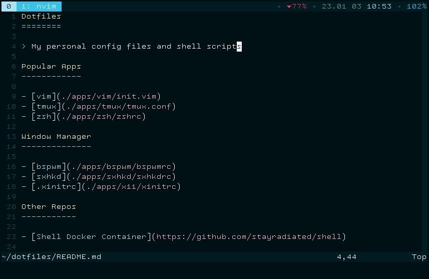

Dotfiles
========

> My personal config files and shell scripts



Popular Apps
------------

- [vim](./apps/vim/init.vim)
- [tmux](./apps/tmux/tmux.conf)
- [zsh](./apps/zsh/zshrc)

Window Manager
--------------

- [bspwm](./apps/bspwm/bspwmrc)
- [sxhkd](./apps/sxhkd/sxhkdrc)
- [.xinitrc](./apps/x11/xinitrc)

Other Repos
-----------

- [Shell Docker Container](https://github.com/stayradiated/shell)

### Installation

```shell
git clone https://github.com/stayradiated/dotfiles
cd dotfiles

# decrypt encrypted files
git-crypt unlock ~/secret-key

# install symlinks and plugins
make apps
```
